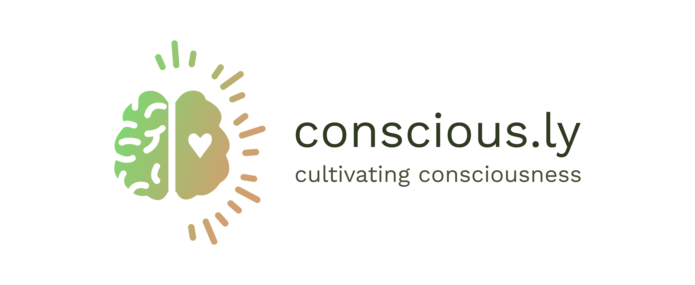
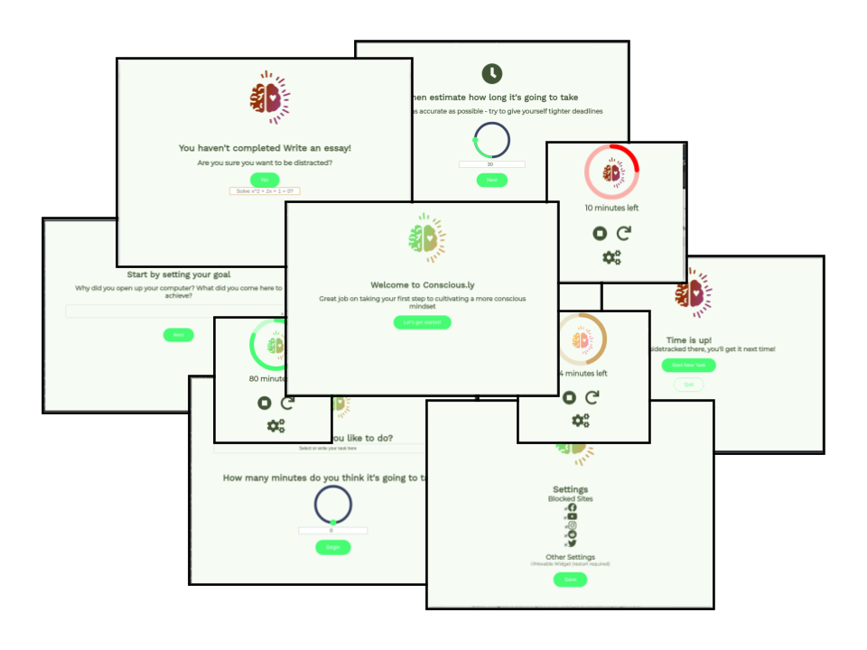

<div align="center">
  
</div>
<div align="center">
  
</div>

---

## Overview

Conscious.ly is a companion app that will empower you cultivate your conscious thought and avoid getting into "automatic mode"

The approach is similar to that used in CBT - i.e set yourself time constrained goal and have someone remind you and hold you

Consciously is still in its early stages, so feedback and contributions are welcome and appreciated! :seedling:

## Features

- Automatic reminders of your task based on the time you set
- Pop-up reminders when you try to access a blocked site
- Syncing with the Conscious.ly [mobile client](https://github.com/conscious-ly/app) (alpha)

## Roadmap

Future plans for enhancements and development :memo: :

- Move over to Typescript React - vue-electron is not as well supported
- More thoroughly test the syncing
- Add various quality-of-life improvements to make using the app as seamless as possible

## Technical

Conscious.ly is built with [Vue.js](https://github.com/vuejs/vue), [Electron](https://github.com/electron/electron), and [electron-vue](https://github.com/SimulatedGREG/electron-vue).

## Running the App

#### Prerequisites

- [node](https://nodejs.org)
- [yarn](https://yarnpkg.com)

Clone this repository, `cd` into the cloned folder and run the following commands:

``` bash
# install dependencies
yarn

# start the application
yarn electron:serve
```

---
